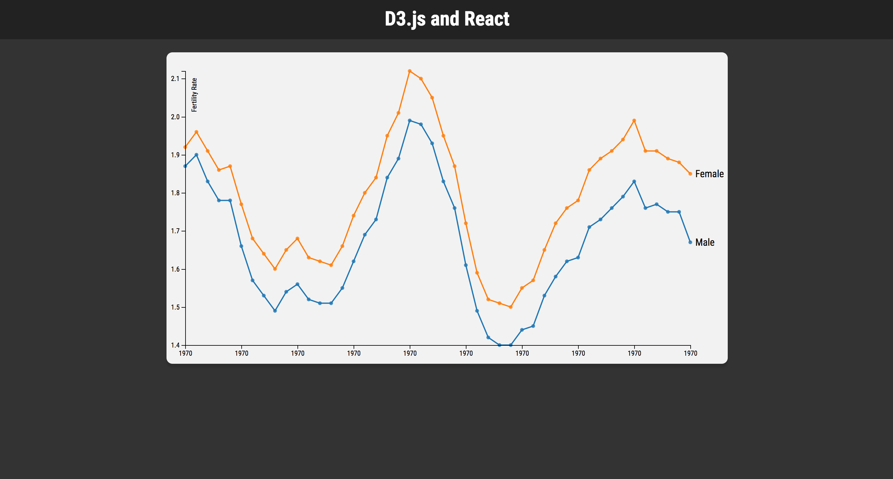

# D3.js and React.js Workshop

#### Setup

You will need to ensure you have [Node.js](https://nodejs.org/en/) installed on your machine. To install and check version:
```bash
$ brew install node
$ node --version
```

Secondly, clone this repo and install project dependencies.
```bash
$ git clone https://github.com/owain-stratton/d3_w0rk5h0p.git
$ cd ~/d3_w0rk5h0p
$ npm install
```

The project has a number of **npm** scripts available from **create-react-app** which was used to create our development environment without having to worry about setting up Webpack, Babel etc...

#### Development

To start the **Webpack-dev-server** run the following command:
```bash
$ npm start
# Then navigate in the browser to http://localhost:3000
```

## Technology Introduction
### D3.js


[D3.js](https://d3js.org/) is a JavaScript library for driving the manipulation of documents, charts and maps amongst others using **DATA**. More information can be found on their website as well as a plethora of [examples](https://github.com/d3/d3/wiki/Gallery) and detailed [documentation](https://github.com/d3/d3/wiki).

### React.js

[React.js](https://facebook.github.io/react/) is a library for building user interfaces.

1. **Declarative** - Painless way to create interactive UIs by designing simple *views* for each state of your application.
2. **Component Based** - Encapsulation of components that manage their own state.
3. **Learn Once, Write Anywhere** - Powerful philosophy on how to develop applications by making fewer assumptions of your tech stack.


## Why D3.js and React.js??
##### Why the F#@K not?

Seriously though, D3 is fantastic at creating simple or vastly complex visualizations based on data. However, it works similar to jQuery by selecting elements in the DOM and appending, updating and removing them. This was always a tedious part of the development process with D3. Then React came along with its super easy way of rendering DOM elements. Therefore we want to leverage the efficient, declarative and reusable components of React with the data utility functions from D3.

This workshop aims to give you an introduction to using D3 and React to make a simple line chart:



## Tutorial Steps

1. Import the fertility rate data from `data/BE0701AA.csv` and map it to convenient data structure using for visualizing data for *males* and *females*.

2. Pass the data imported to an **svg** chart and render points as **circle** elements for each gender.

3. Generate an **svg path** elements to show the trend of fertility rate changes from 1970 to 2015.

4. Add *axes*, a *legend* and *color* to the chart make it simpler for users to interpret the data.

#### Possible Homework/Improvements/Fixes

1. X axis currently only shows one year **1970** for each year (konstigt :frowning:).
2. Animate the chart as the component mounts **hint**: use `componentDidMount()` lifecycle method.
3. Add mouse events to show the user a tooltip when they interact with the chart **hint**: add eventListeners to component lifecycle methods.
4. Add some ancillary data to give the fertility data more context. Perhaps there were some political decisions made that caused rates to rise and fall.


### Data

The data is courtesy of the open data database from **SCB**. You can find more data here: http://www.statistikdatabasen.scb.se/pxweb/en/ssd/
